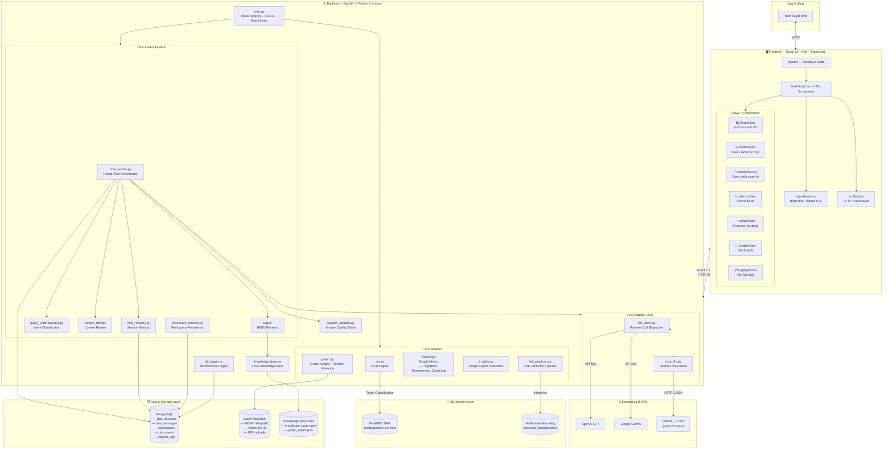
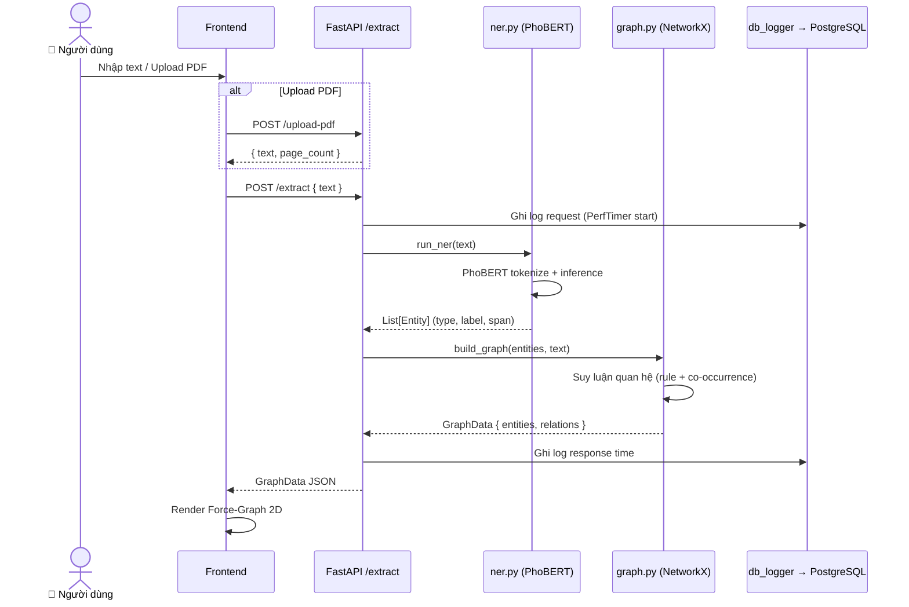
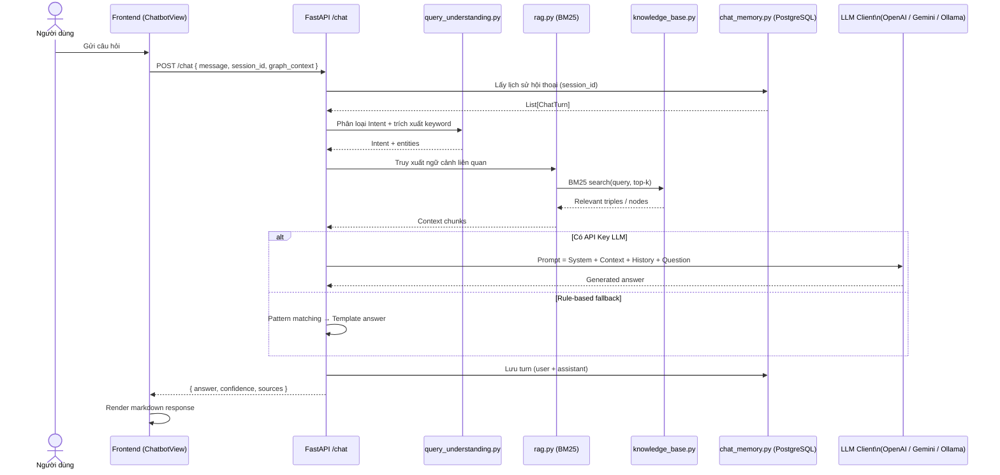
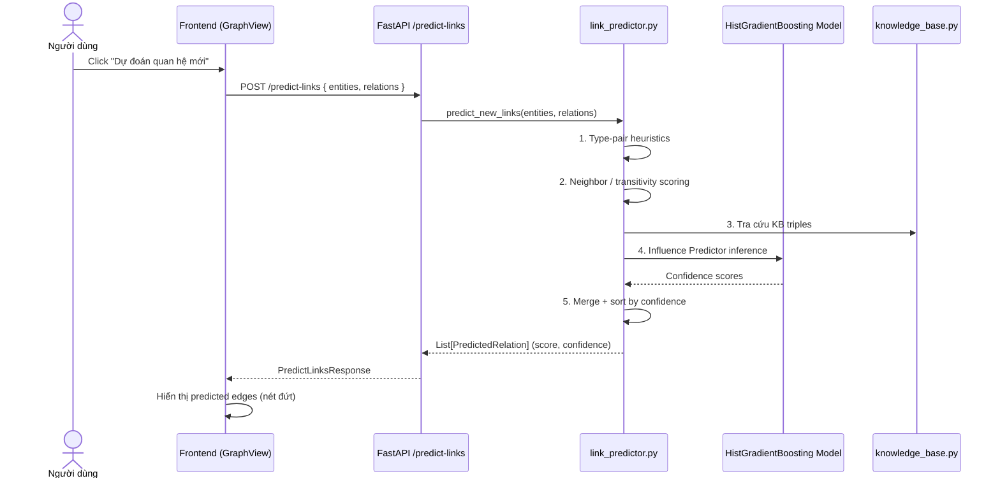
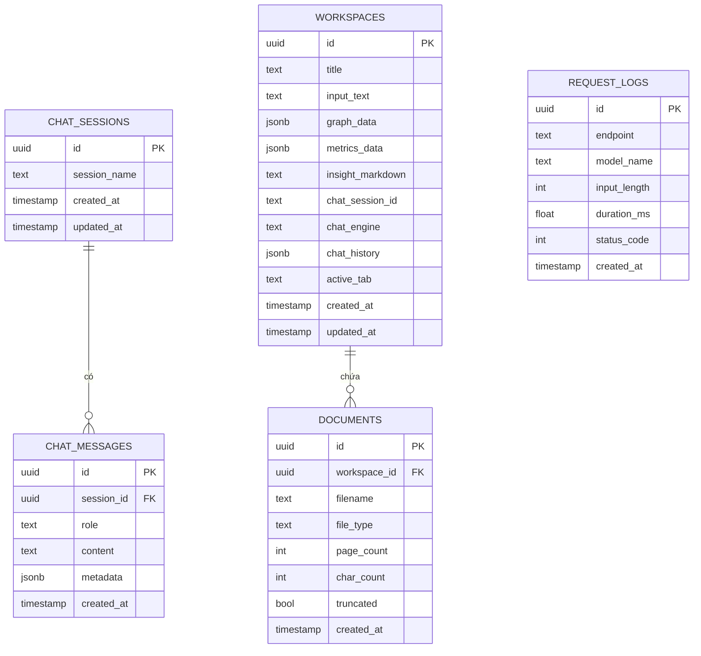

# 🗺️ Sơ đồ Kiến trúc Hệ thống — Knowledge Graph Extractor

## 1. Kiến trúc Tổng thể (High-Level)

---

## 2. Luồng Xử lý Trích xuất Đồ thị

---

## 3. Luồng Chatbot Hybrid (RAG + LLM)

---

## 4. Luồng Link Prediction

---

## 5. Sơ đồ Cơ sở dữ liệu

---

## 6. Stack Công nghệ Tóm tắt

| Tầng                | Công nghệ                                               |
| ------------------- | ------------------------------------------------------- |
| **Frontend**        | React 19, TypeScript, Vite, react-force-graph-2d, D3.js |
| **Backend**         | FastAPI, Uvicorn, Python 3.11+                          |
| **NER Model**       | PhoBERT fine-tuned (HuggingFace Transformers + PyTorch) |
| **Link Prediction** | Scikit-learn HistGradientBoostingClassifier             |
| **Graph Engine**    | NetworkX                                                |
| **RAG Search**      | BM25 (rank-bm25)                                        |
| **Chat Memory**     | PostgreSQL (psycopg2)                                   |
| **LLM Adapters**    | OpenAI API, Google Gemini API, Ollama (local)           |
| **File Storage**    | Local Filesystem — GEXF, GraphML, JSON triples          |
| **Rate Limiting**   | SlowAPI (per-IP)                                        |
| **PDF Parsing**     | pypdf                                                   |
