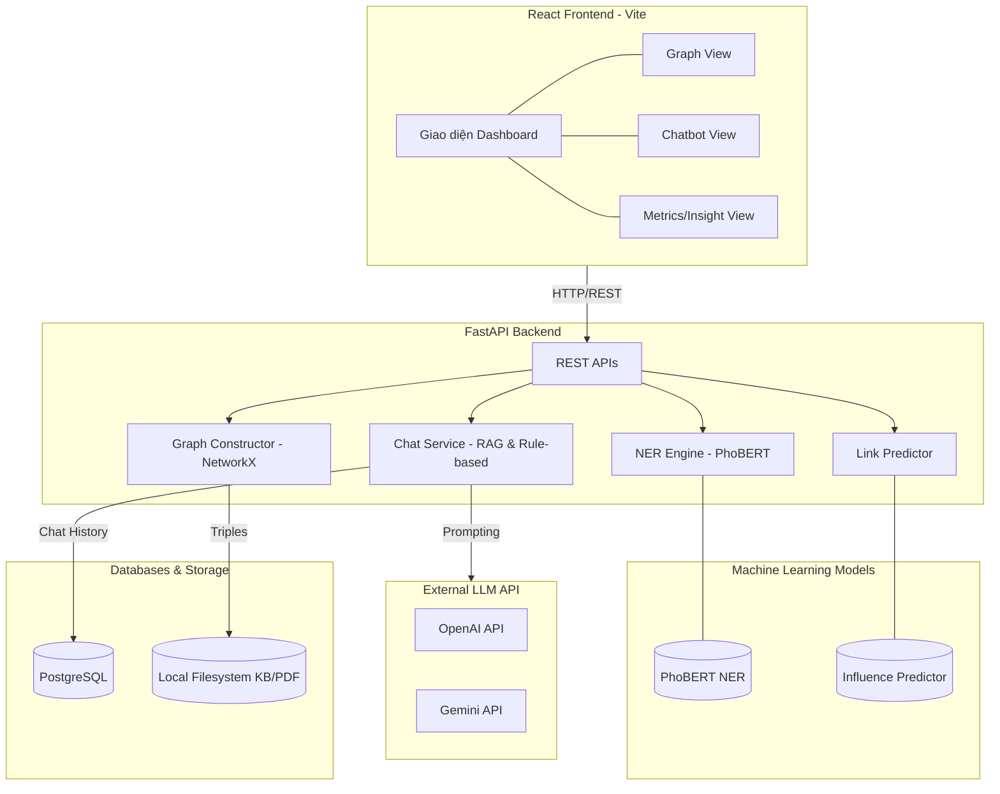

# Thiết kế kiến trúc hệ thống

Tài liệu này mô tả kiến trúc tổng thể của hệ thống **Knowledge Graph Extractor**. Hệ thống được thiết kế theo mô hình client-server, kết hợp AI Models và hệ quản trị CSDL để cung cấp giải pháp khai phá và hỏi đáp trên đồ thị tri thức.

## 1. Sơ đồ kiến trúc tổng thể

## 2. Chi tiết các thành phần chính

### 2.1 Frontend Layer (Presentation)
- **Công nghệ:** React 19, Vite, TypeScript, Tailwind CSS.
- **Thư viện đồ thị:** `react-force-graph-2d` (render 2D Canvas hiệu năng cao) và D3.js.
- **Vai trò:** Nhận dữ liệu text/PDF từ người dùng, gọi API trích xuất và hiển thị trực quan các thẻ Tab (Graph, Highlight, Entities, Metrics, Chatbot).

### 2.2 Backend Layer (Application & API)
- **Công nghệ:** FastAPI (Python), Uvicorn.
- **Thư viện chính:** `transformers`, `torch`, `networkx`, `rank-bm25`.
- **Vai trò:**
  - **Module NER (`ner.py`):** Xử lý văn bản thô, chạy qua mô hình PhoBERT để gán nhãn thực thể.
  - **Module Đồ thị (`graph.py`, `metrics.py`):** Xây dựng mạng lưới từ thực thể và quan hệ, tính toán các chỉ số toán học đồ thị.
  - **Module Chat & RAG (`chat_service.py`, `rag.py`):** Điều phối yêu cầu hỏi đáp. Truy xuất tài liệu liên quan bằng thuật toán BM25 và đưa ngữ cảnh cho LLM.
  - **Module PDF (`main.py`):** Sử dụng `pypdf` để bóc tách text từ file upload.

### 2.3 Model Layer (AI/ML)
- **Mô hình PhoBERT NER:** Trọng số được lưu trong `model/phobert-ner-final`, chạy local.
- **Mô hình Influence Predictor:** Lưu dưới dạng `influence_predictor.joblib`, dự đoán quan hệ tiềm năng giữa các node.
- **Mô hình sinh văn bản (LLM):** Gọi qua API của bên thứ 3 để giải quyết câu hỏi phức tạp thay thế logic rule-based.

### 2.4 Data Layer (Storage)
- **PostgreSQL (`chat_memory`):** Lưu trữ lịch sử hội thoại của người dùng giúp truy xuất ngữ cảnh dài hạn (Long-term memory).
- **Filesystem:** Chứa các tệp mô hình, dữ liệu xuất ra của Graph (GEXF/GraphML) để dùng làm Local Knowledge Base.

## 3. Luồng xử lý nghiệp vụ chính (Data Flow)

### Luồng Trích xuất Đồ thị (Extraction Flow)
1. Người dùng gửi văn bản / file PDF từ UI.
2. API `/extract` nhận yêu cầu, đẩy đoạn text vào mô hình NER PhoBERT.
3. Hệ thống trả về mảng Entities (thực thể).
4. Khối xử lý luật và đồ thị nối các Entities lại thành Relations (quan hệ).
5. Phản hồi JSON được gửi về React để render lên giao diện Force Graph.

### Luồng Chatbot (Hybrid Chat Flow)
1. User gửi câu hỏi + ID Phiên chat (Session ID).
2. Backend lấy lịch sử hội thoại từ PostgreSQL.
3. **RAG Retrieval:** Tìm kiếm các nodes/quan hệ trong KB khớp với câu hỏi bằng BM25.
4. **Engine Routing:** 
   - Nếu có API Key LLM: Gửi câu hỏi, Context, và History lên LLM sinh câu trả lời.
   - Nếu không có: Dùng Rule-based Engine phân loại Intent và trả lời theo form dựng sẵn.
5. Lưu câu trả lời vào PostgreSQL và trả về cho Frontend.
