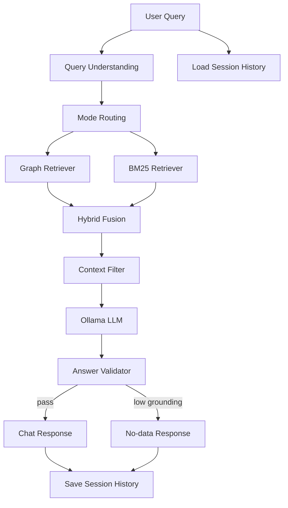

# Chatbot Architecture (Detailed)

Tai lieu nay mo ta chi tiet chatbot hien tai trong project, tap trung vao luong xu ly thuc te dang chay trong code.

## 1) Muc tieu chatbot

- Tra loi cau hoi dua tren du lieu co san trong he thong (Knowledge Graph + Input text + Knowledge Base).
- Giam hallucination bang retrieval + context filter + validation.
- Ho tro hoi dap da luot (follow-up) voi session memory.
- Hoat dong on dinh tren local voi Ollama, va co fallback an toan sang rule-based.

## 2) Kien truc tong the



## 3) Cac thanh phan chinh

### 3.1 `server/query_understanding.py`

Lop parse query dau vao truoc retrieval:

- Intent: `relationship`, `count`, `summary`, `entity_lookup`, `compare`, `kb_lookup`, `neighbors`, `top_nodes`, `source_text`, `type_list`, `help`, `greeting`, ...
- Mode:
  - `deterministic`: route rule-based (khong can LLM)
  - `graph_first`: uu tien graph retrieval
  - `hybrid`: can bang graph + BM25
- Detect entity mention (exact -> substring -> remove diacritics -> fuzzy).
- Detect follow-up (pronoun + short-query + history).
- Resolve entity tu history khi query follow-up mo ho.

### 3.2 `server/graph_retriever.py`

Hybrid retrieval layer:

- Graph-first docs:
  - `graph_entity` (entity card + relation lien quan)
  - `graph_relation` (triple truc tiep giua entities)
  - `graph_path` (2-hop path cho relationship query)
  - `kb_triple` (triple bo sung tu KB)
- BM25 docs:
  - `input_text`, `entity`, `relation`, `kb_triple` tu `rag.py`
- Fusion:
  - `graph_first`: graph docs truoc, BM25 bo sung
  - `hybrid`: interleave graph va BM25 theo rank

### 3.3 `server/context_filter.py`

Loc context truoc khi gui LLM:

1. Tinh overlap theo entity trong query  
2. Boost score theo source type (`graph_relation`/`graph_path` uu tien cao)  
3. Loai chunk gan-trung (SequenceMatcher dedup)  
4. Cat theo token budget (`graph_first` < `hybrid`)

Muc dich: giam nhieu context, tang grounding.

### 3.4 `server/llm_client.py`

LLM adapter:

- Provider:
  - `ollama` (khuyen nghi hien tai)
  - `local` (giu de fallback ky thuat)
- Ollama call:
  - endpoint: `POST /api/chat`
  - config qua env: `OLLAMA_BASE_URL`, `OLLAMA_MODEL`, `OLLAMA_TIMEOUT`, `LLM_MAX_NEW_TOKENS`, `LLM_TEMPERATURE`
- Loi ket noi/timeout/HTTP error se throw de chat_service fallback.

### 3.5 `server/answer_validator.py`

Guardrail sau LLM:

- Check no-data phrase (`khong du du lieu`, `no information`, ...)
- Trich xuat claims tu markdown pattern (`**entity**`, `[entity]`, `--(relation)-->`)
- Doi chieu claims voi retrieved context
- Tinh:
  - `confidence` (0-1)
  - `evidence_count`
  - `unsupported_claims`
- Neu grounding qua thap va khong co evidence -> thay bang no-data response chuan.

### 3.6 `server/chat_service.py`

Orchestration trung tam:

1. Ensure session + load history  
2. Parse query (`parse_query`)  
3. Neu deterministic intent -> rule-based  
4. Neu LLM path:
   - `hybrid_retrieve`
   - `filter_context`
   - `format_context_for_llm`
   - call LLM (`_call_llm_with_context`)
   - `validate_answer`
5. Neu loi/khong dat -> fallback rule/no-data  
6. Save response vao memory  
7. Return `ChatResponse`

Co structured logging theo `request_id` cho:
- intent/mode/entities
- retrieval timing va so docs
- llm timing, validation, confidence
- tong latency

## 4) Chat API contract hien tai

`POST /chat`

Request (rut gon):
- `session_id`
- `message`
- `entities`, `relations`
- `input_text`

Response (`schemas.ChatResponse`):
- `session_id`
- `reply`
- `engine` (`ollama` | `local` | `rule-based`)
- `history`
- `confidence`
- `evidence_count`
- `intent`

## 5) Memory va follow-up

- Memory luu qua `chat_memory` (PostgreSQL).
- Truoc khi add user message moi, service load recent history de detect follow-up.
- Follow-up query co the thua huong entity tu cac turn user gan nhat.
- Neu DB khong kha dung: chat van chay o che do giam cap (`ephemeral`).

## 6) Cac che do tra loi

- **Deterministic mode** (uu tien toc do + on dinh):
  - count, top, help, relation list, source text, ...
  - route truc tiep rule-based
- **Graph-first mode**:
  - relationship, entity lookup, compare, neighbors
  - graph retrieval la nguon chinh
- **Hybrid mode**:
  - summary/unknown queries
  - ket hop graph + BM25 de mo rong context

## 7) Fallback va anti-hallucination

- LLM loi (timeout/connect/HTTP): fallback sang rule-based.
- Answer khong co grounding trong context: thay no-data response:
  - `Khong du du lieu trong he thong de tra loi cau hoi nay.`
- Result luon co `engine`, `confidence`, `evidence_count` de frontend/noi bo theo doi chat luong.

## 8) Cau hinh env khuyen nghi (local)

```env
LLM_PROVIDER=ollama
OLLAMA_BASE_URL=http://localhost:11434
OLLAMA_MODEL=qwen2.5:3b
OLLAMA_TIMEOUT=60
LLM_MAX_NEW_TOKENS=384
LLM_TEMPERATURE=0.15
CHAT_PREFER_RULE_FOR_KEYWORDS=true
```

## 9) Van hanh nhanh

1. Start Ollama:
   - `ollama serve`
2. Pull model:
   - `ollama pull qwen2.5:3b`
3. Start backend:
   - `npm run server` (script dang dung `py server/main.py`)
4. Health check:
   - `GET /health`
5. Test chat:
   - `POST /chat` voi graph context.

## 10) Gioi han hien tai va huong mo rong

### Gioi han
- Confidence la heuristic, chua phai factuality metric chuan.
- Validator grounding hien o muc lexical/pattern, chua co NLI hoac claim verifier nang cao.
- Dedup context dung SequenceMatcher, co the bo sot duplicate semantic phuc tap.

### Mo rong tiep theo (neu can)
- Re-ranker cho retrieval sau BM25.
- Validator claim-level nang cao (NLI / symbolic check).
- Response citation (`evidence_ids`) tra ve frontend.
- Dashboard debug trace cho tung request (`query -> retrieved -> filtered -> answer`).

---

Neu ban muon, minh co the viet them ban `chatbot-architecture-detailed-en.md` de doi tac non-Vietnamese de doc.
