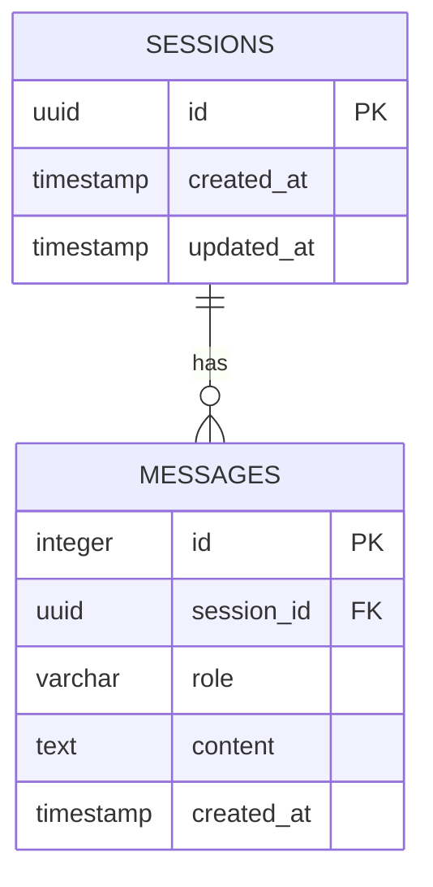

# Thiết kế Cơ sở dữ liệu (Database Design)

Hệ thống sử dụng hệ quản trị **PostgreSQL** để lưu trữ cấu trúc tĩnh (Memory của Chatbot), đồng thời kết hợp lưu trữ dưới dạng file trên hệ điều hành cục bộ (đối với Graph Models).

## 1. Lưu trữ Relational Database (PostgreSQL)

Mục đích chính của database này là quản lý phiên hội thoại của người dùng với Chatbot, đáp ứng yêu cầu cho Long-term memory của RAG pipeline.

### Sơ đồ quan hệ (ERD)

### 1.1 Bảng `sessions`
Chứa thông tin quản lý các phiên chat định danh.

| Cột | Kiểu dữ liệu | Ràng buộc | Mô tả |
|---|---|---|---|
| `id` | `UUID` | PRIMARY KEY | ID định danh duy nhất của phiên |
| `created_at` | `TIMESTAMP` | DEFAULT NOW() | Thời điểm tạo phiên |
| `updated_at` | `TIMESTAMP` | DEFAULT NOW() | Cập nhật khi có tin nhắn mới |

### 1.2 Bảng `messages`
Lưu trữ nội dung chi tiết từng lượt hỏi đáp.

| Cột | Kiểu dữ liệu | Ràng buộc | Mô tả |
|---|---|---|---|
| `id` | `SERIAL` | PRIMARY KEY | ID tự tăng của tin nhắn |
| `session_id` | `UUID` | FOREIGN KEY | Liên kết với bảng `sessions` (ON DELETE CASCADE) |
| `role` | `VARCHAR(50)` | NOT NULL | Vai trò: `user`, `model`, hoặc `system` |
| `content` | `TEXT` | NOT NULL | Nội dung câu hỏi/trả lời |
| `created_at` | `TIMESTAMP` | DEFAULT NOW() | Thời gian gửi tin nhắn |

*Lưu ý:* Bảng `messages` được tạo chỉ mục (index) trên cột `session_id` và sắp xếp theo `created_at` để tối ưu truy vấn khi load lịch sử hội thoại.

---

## 2. Lưu trữ Knowledge Graph & Files (Filesystem)

Dự án không dùng một Graph Database hoàn chỉnh như Neo4j ở môi trường dev để tiết kiệm tài nguyên hệ thống, thay vào đó sử dụng cấu trúc file tiêu chuẩn của NetworkX.

### 2.1 File Đồ thị gốc
- **`knowledge_graph.gexf`** & **`knowledge_graph.graphml.xml`**:
  - Lưu toàn bộ cấu trúc đồ thị (Nodes, Edges, và Attributes).
  - Dễ dàng import vào phần mềm phân tích chuyên dụng (Gephi).
  - Được load vào bộ nhớ RAM (bởi backend Python) mỗi khi khởi động API.

### 2.2 File Dữ liệu mô hình (Model Checkpoints)
- **`model/phobert-ner-final/`**:
  - `model.safetensors`: Trọng số (weights) mô hình HuggingFace.
  - `config.json`: File cấu hình kiến trúc model.
- **`influence_predictor.joblib`**: 
  - Mô hình Scikit-learn đã qua huấn luyện dùng cho bài toán Link Prediction, chứa các hệ số weights của Logistic Regression/Random Forest.

### 2.3 Feature Matrix
- Lưu trong thư mục `feature_engineering_output/`:
  - `node_features.csv`: Cấu trúc mảng 2 chiều chứa Vector đại diện cho độ đo (Centrality, PageRank) của từng Node. Dùng làm Input vào model Link Prediction.
  - `triples.csv`: Lưu trữ danh sách các Cạnh trực quan (Head Entity - Relation - Tail Entity) dùng trong hệ thống RAG Knowledge Base.
