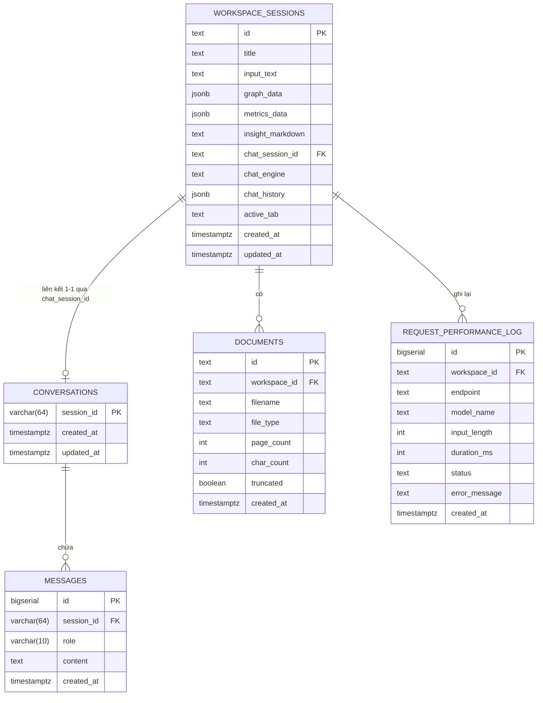

# Thiết Kế Cơ Sở Dữ Liệu - Knowledge Graph Extractor (v2)

Hệ thống sử dụng **PostgreSQL** để lưu trữ dữ liệu vận hành và **Filesystem** để lưu các model và file đồ thị lớn.

> **v2 Changes:** Đổi tên `chat_sessions` → `conversations`, `chat_messages` → `messages`. Thêm bảng `documents` và `request_performance_log`.

## 1. Lưu trữ Relational Database (PostgreSQL)

### Sơ đồ quan hệ (ERD)



---

### 1.1 Bảng `workspace_sessions`
Lưu trữ toàn bộ trạng thái một phiên làm việc (Dashboard, Graph, Chat).

| Cột | Kiểu dữ liệu | Ràng buộc | Mô tả |
|---|---|---|---|
| `id` | `TEXT` | PRIMARY KEY | ID định danh workspace (UUID) |
| `title` | `TEXT` | NOT NULL | Tên phiên làm việc |
| `input_text` | `TEXT` | DEFAULT '' | Văn bản gốc người dùng nhập |
| `graph_data` | `JSONB` | | Dữ liệu đồ thị (nodes, edges) đã trích xuất |
| `metrics_data` | `JSONB` | | Các chỉ số thống kê của đồ thị |
| `insight_markdown` | `TEXT` | | Báo cáo phân tích sinh bởi LLM |
| `chat_session_id` | `TEXT` | | ID liên kết với bảng `conversations` |
| `chat_engine` | `TEXT` | | Model LLM sử dụng (`ollama`, `local`) |
| `chat_history` | `JSONB` | | Lưu mảng lịch sử chat (tương thích ngược) |
| `active_tab` | `TEXT` | DEFAULT 'graph' | Tab cuối cùng đang xem |
| `created_at` | `TIMESTAMPTZ` | DEFAULT NOW() | Thời điểm tạo |
| `updated_at` | `TIMESTAMPTZ` | DEFAULT NOW() | Thời điểm cập nhật cuối |

*Index:* `updated_at DESC` để truy xuất nhanh danh sách workspace gần đây.

---

### 1.2 Bảng `conversations` *(đổi tên từ `chat_sessions`)*
Quản lý các phiên hội thoại giữa người dùng và chatbot.

| Cột | Kiểu dữ liệu | Ràng buộc | Mô tả |
|---|---|---|---|
| `session_id` | `VARCHAR(64)` | PRIMARY KEY | ID định danh phiên hội thoại |
| `created_at` | `TIMESTAMPTZ` | DEFAULT NOW() | Thời điểm tạo |
| `updated_at` | `TIMESTAMPTZ` | DEFAULT NOW() | Cập nhật khi có tin nhắn mới |

---

### 1.3 Bảng `messages` *(đổi tên từ `chat_messages`)*
Lưu trữ nội dung từng lượt hỏi đáp trong Chatbot.

| Cột | Kiểu dữ liệu | Ràng buộc | Mô tả |
|---|---|---|---|
| `id` | `BIGSERIAL` | PRIMARY KEY | ID tự tăng |
| `session_id` | `VARCHAR(64)` | FOREIGN KEY | Liên kết `conversations` (ON DELETE CASCADE) |
| `role` | `VARCHAR(10)` | CHECK ('user','model') | Vai trò người gửi |
| `content` | `TEXT` | NOT NULL | Nội dung tin nhắn |
| `created_at` | `TIMESTAMPTZ` | DEFAULT NOW() | Thời gian gửi |

*Index:* `idx_messages_session` trên `(session_id, created_at)`.

---

### 1.4 Bảng `documents` *(mới)*
Lưu thông tin tài liệu người dùng tải lên hoặc hệ thống tiếp nhận để xử lý.

| Cột | Kiểu dữ liệu | Ràng buộc | Mô tả |
|---|---|---|---|
| `id` | `TEXT` | PRIMARY KEY | UUID tự sinh |
| `workspace_id` | `TEXT` | FK → `workspace_sessions` | Workspace chứa tài liệu |
| `filename` | `TEXT` | NOT NULL | Tên file gốc |
| `file_type` | `TEXT` | CHECK ('pdf','text') | Loại tài liệu |
| `page_count` | `INT` | | Số trang (nếu là PDF) |
| `char_count` | `INT` | | Số ký tự sau khi trích xuất |
| `truncated` | `BOOLEAN` | DEFAULT FALSE | Có bị cắt bớt do vượt giới hạn không |
| `created_at` | `TIMESTAMPTZ` | DEFAULT NOW() | Thời điểm tải lên |

*Index:* `idx_documents_workspace` trên `(workspace_id, created_at DESC)`.

---

### 1.5 Bảng `request_performance_log` *(mới)*
Ghi lại thời gian phản hồi và trạng thái mỗi lần gọi Ollama / NER model.

| Cột | Kiểu dữ liệu | Ràng buộc | Mô tả |
|---|---|---|---|
| `id` | `BIGSERIAL` | PRIMARY KEY | |
| `workspace_id` | `TEXT` | FK → `workspace_sessions` | Workspace liên quan |
| `endpoint` | `TEXT` | NOT NULL | `/extract`, `/chat`, `/insight`, `/predict-links` |
| `model_name` | `TEXT` | | `qwen2.5:3b`, `phobert-ner`, `local`… |
| `input_length` | `INT` | | Số ký tự đầu vào |
| `duration_ms` | `INT` | NOT NULL | Thời gian xử lý (ms) |
| `status` | `TEXT` | CHECK ('success','timeout','error') | Kết quả |
| `error_message` | `TEXT` | | Lỗi nếu có |
| `created_at` | `TIMESTAMPTZ` | DEFAULT NOW() | |

*Index:* trên `(workspace_id, created_at DESC)` và `(endpoint, created_at DESC)`.

---

## 2. Lưu trữ Files (Filesystem)

### 2.1 File Đồ thị gốc
- **`knowledge_graph.gexf`** & **`knowledge_graph.graphml.xml`**: Cấu trúc đồ thị đầy đủ, load vào NetworkX khi khởi động server.

### 2.2 Model Checkpoints
- **`model/phobert-ner-final/`**: Trọng số PhoBERT đã fine-tune cho NER.
- **`influence_predictor.joblib`**: Model HistGradientBoostingClassifier cho Link Prediction.

### 2.3 Feature Matrix
- **`feature_engineering_output/node_features.csv`**: Vector độ đo đồ thị (input cho link prediction).
- **`feature_engineering_output/triples.csv`**: Danh sách triples phục vụ RAG Knowledge Base.

---

## 3. Hướng dẫn Migration

```bash
# Database mới (fresh install)
psql $DATABASE_URL -f server/sql/schema.sql

# Database cũ đang có dữ liệu (upgrade từ v1)
psql $DATABASE_URL -f server/sql/migration_v2.sql
```
